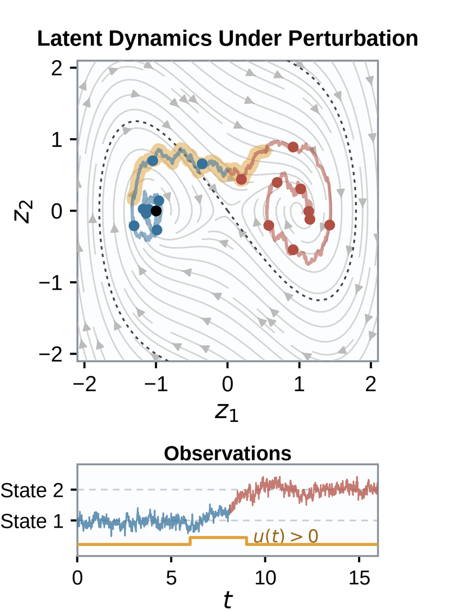

# Perturbational validity simulation

Contains supplemental materials and code to reproduce the results of the manuscript
*Perturbational Validity for Foundation Models of Brain Dynamics: A Controlled
Proof-of-Principle Simulation*

<p align="center">
  
</p>

<p align="center">
  <em>A controlled input drives the latent state across the basin boundary.
  Passive observation alone never reveals this transition.</em>
</p>

The code runs a controlled proof of principle experiment: after limited adaptation to
a new system, does a population-pretrained model still predict what happens when
the system is actively driven?

Stochastic bistable systems are generated from a shared population family. Two
otherwise identical multilayer perceptrons are pretrained on drift evaluations
sampled from either passive or input-driven trajectories. For each held-out
system the shared weights are frozen and only a three-dimensional embedding is
adapted. A correctly specified cubic model fitted from scratch is the
non-pretrained comparator. Models are compared on time-series accuracy,
dynamical structure, and responses to perturbations excluded from calibration.

The main code is Python, but we also include a MATLAB script in `matlab/`,
an early "sandbox" of the original idea that we used to pilot the simulation.
That code was produced by Hamidreza Jamalabadi. The Python implementation is
based on it, reproduces it, and extends its functionality.

## Requirements

Python 3.13 with [uv](https://docs.astral.sh/uv/). Figure 1 additionally needs
`pdflatex`.

## Reproduce

```bash
make reproduce
```

Or step by step:

```bash
make simulation   # Figures 2-4
make robustness   # Figures S1-S2
make figure1      # Figure 1
make test         # numerical checks
```

Everything is written under `results/`, which is not tracked:

| Figure | File |
| --- | --- |
| 1 | `results/figure1/Figure_1_concept.pdf` |
| 2 | `results/simulation/Figure_2_coverage.pdf` |
| 3 | `results/simulation/Figure_3_mechanistic_validation.pdf` |
| 4 | `results/simulation/Figure_4_few_shot_metrics.pdf` |
| S1 | `results/robustness/Figure_S1_robustness_controls.pdf` |
| S2 | `results/robustness/Figure_S2_sensitivity.pdf` |

Each figure is also written as PNG and TIFF. Subject-level and run-level metrics
are written as CSV alongside them.

Runtimes on 12 workers: the simulation takes about 1.5 minutes. The robustness
sweep takes about 2 minutes per seed and runs five seeds, plus a reduced
sensitivity design over three seeds.

## Layout

```
perturbsim/                 simulation, models, metrics, figures
run_simulation.py           Figures 2-4 and the metric summary
run_robustness.py           repeated-seed and sensitivity sweeps
make_robustness_figures.py  Figures S1-S2 from the sweep output
test_perturbsim.py          numerical checks
figure1/                    schematic panels and vector compositor
matlab/                     original MATLAB simulation
```

`run_simulation.py --stage figures` replots from the cached results without
rerunning the simulation. `--quick` runs a reduced configuration for checking
the pipeline; its numbers are not the reported ones.

Results are deterministic given a seed. The primary seed is 11; the robustness
sweep uses 11, 23, 37, 51 and 71.

## Reference

Simulation code for a manuscript on perturbational validity for foundation
models of brain dynamics. Citation details will be added on publication.

## License

BSD 3-Clause. See `LICENSE`.
